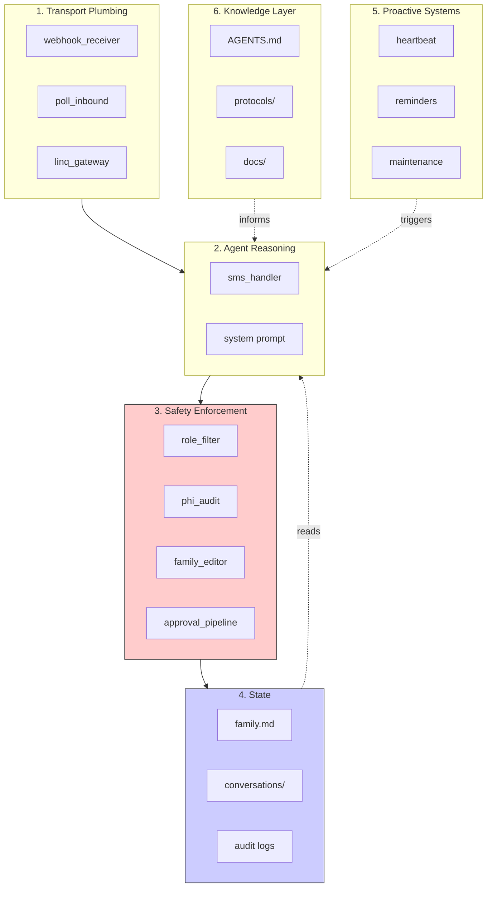

## Architecture overview

CareSupport is organized into 6 domains with clear dependency rules and enforcement boundaries.



---

## Domain breakdown

<AccordionGroup>
  <Accordion title="1. Transport Plumbing" icon="plug">
    **Purpose:** Moves bytes between messaging providers and the agent. No intelligence.
    
    **Components:**
    - `webhook_receiver.py` - Real-time push from Linq (iMessage/RCS)
    - `poll_inbound.py` - 15-second cron poll (SMS fallback)
    - `linq_gateway.py` - Send/receive client for Linq Partner API V3
    - `reaction_handler.py` - iMessage tapback processing
    
    **Location:** `runtime/scripts/`
    
    **Configuration:** `runtime/config.py` (LinqConfig)
    
    **Rules:**
    - Plumbing never reasons. It routes.
    - No business logic in this layer.
    - Hands messages to the agent, gets responses back, delivers them.
    
    <Note>
      **iMessage support:** The Linq API provides access to Apple's iMessage network. This enables read receipts, typing indicators, and tapback reactions (👍, ❤️, ❓, etc.)
    </Note>
  </Accordion>

  <Accordion title="2. Agent Reasoning" icon="brain">
    **Purpose:** The AI that reads family context, understands intent, and generates responses.
    
    **Core handler:** `runtime/scripts/sms_handler.py`
    - 1243 lines
    - 13-step pipeline (see [How It Works](/how-it-works))
    - Async/await with 45s timeout per AI call
    - Fallback chain: Haiku → Gemini Flash → GPT-4o-mini
    
    **System prompt assembly:**
    - `SOUL.md` - Identity and voice (~74 lines, loaded every message)
    - `agent_root.md` - Routing logic for protocol selection
    - `capabilities.md` - Explicit CAN/CANNOT list
    - `skills/*.md` - Conversation patterns
    - `lessons.md` - Accumulated corrections (max 20 global + 30 per family)
    
    **Care protocols:** `fork/workspace/protocols/` (16 protocols)
    - appointment-coordination
    - benefits-navigation
    - care-plan-updates
    - care-schedules
    - caregiver-handoff
    - daily-check-in
    - emergency-response
    - family-admin
    - family-onboarding
    - general-tools
    - hospitalization
    - insurance-benefits
    - medication-management
    - protocol-creation (meta)
    - provider-communication
    - wellness-monitoring
    
    **Validation:** `fork/simulation/` - 5 test families, 52 conversations, 99.5% success rate
    
    **Rules:**
    - Reasoning never stores directly. It requests state changes through enforcement.
    - All context is pre-filtered by access level before the AI sees it.
    - Responses are post-checked for leakage before sending.
  </Accordion>

  <Accordion title="3. Safety Enforcement" icon="shield-check">
    **Purpose:** Mechanical checks that run before and after the AI processes messages. Not prompt-level — code-level.
    
    **Components:**
    
    **role_filter.py** - Access control (lines: 40-180)
    - `filter_family_context()` - Pre-filters family.md by access level
    - `check_outbound_message()` - Post-checks for leakage
    - `can_approve()` - Determines who can approve changes
    
    **Access levels:**
    | Level | Who | Can See | Can Do |
    |-------|-----|---------|--------|
    | **full** | Coordinators | Everything | Approve changes, add members |
    | **limited** | Caregivers, family | Care recipient info, schedules, team, meds | Request updates (need approval) |
    | **schedule** | Community supporters | Schedules and basic contact | View only |
    
    **phi_audit.py** - HIPAA audit logging
    - `log_context_load()` - Who accessed what, when, why
    - `log_response_sent()` - What was sent to whom
    - `log_response_blocked()` - What was blocked and why
    - `log_unknown_number()` - Rejected access attempts
    
    **family_editor.py** - Surgical file updates
    - `apply_updates()` - Edit, don't overwrite
    - Creates backup before every change
    - Atomic find-and-replace operations
    - Validation after edit
    
    **approval_pipeline.py** - Confirmation workflow
    - `classify_updates()` - Auto-apply vs. needs-approval
    - `create_pending()` - Queue approval request
    - `resolve_approval()` - Process YES/NO response
    - Expires after 24 hours
    
    **message_lock.py** - Concurrency control
    - Per-family mutex (prevents race conditions)
    - Automatic timeout after 30s
    - Ensures two simultaneous messages to the same family don't corrupt state
    
    **Rules:**
    - Enforcement never reasons. It checks and gates.
    - All checks are mechanical. No prompt engineering for safety.
    - The AI never sees what it's not allowed to see.
    - If the AI tries to leak restricted info, the response is blocked.
    
    <Warning>
      **Security posture:** CareSupport assumes the AI might try to bypass constraints. That's why enforcement happens in code, outside the AI's control.
    </Warning>
  </Accordion>

  <Accordion title="4. State" icon="database">
    **Purpose:** The persistent context that makes the system valuable over time.
    
    **family.md** - Per-family care context
    - Source of truth for each family
    - Markdown format (human-readable)
    - Sections: Care Recipient, Team, Schedule, Medications, Issues, etc.
    - Updated via surgical edits (append/prepend/replace)
    - Spec: `docs/design-docs/family-md-spec.md`
    - Example: `examples/rob-family.md`
    
    **Split files (optional):**
    - `schedule.md` - When family.md gets too long
    - `medications.md` - Detailed medication lists
    - Still loaded together as a unified context
    
    **conversations/** - Message history per phone
    - `conversations/{phone}/YYYY-MM.log`
    - Last 50 messages loaded into agent context
    - Format: `[timestamp] [INBOUND/OUTBOUND] message`
    
    **timeline/** - Family-level event log
    - `families/{id}/timeline/YYYY-MM.log`
    - Cross-member view of all activity
    - Format: `[timestamp] [direction] [member name] message`
    
    **logs/** - System and audit logs
    - PHI audit trail (who accessed what)
    - Agent run logs (performance, errors)
    - Backup chain (before every edit)
    
    **members/** - Individual profiles
    - `families/{id}/members/{name}.md`
    - Communication preferences
    - Care responsibilities
    - Personal context
    - Interaction history
    
    **lessons.md** - Learning system
    - Global: `runtime/learning/lessons.md` (max 20 entries)
    - Per-family: `families/{id}/lessons.md` (max 30 entries)
    - Corrections from conversations
    - Auto-pruned (oldest removed when limit reached)
    
    **Rules:**
    - State is passive. It's read and written, never acts.
    - All writes go through the enforcement layer.
    - Backups before every edit.
    - No direct DB — files are the database.
    
    <Info>
      **Why files?** See [How It Works - Key Design Decisions](/how-it-works#key-design-decisions)
    </Info>
  </Accordion>

  <Accordion title="5. Proactive Systems" icon="clock">
    **Purpose:** Crons that scan, alert, and maintain without waiting for an SMS.
    
    **Planned components:**
    
    **Heartbeat (48-hour scan):**
    - Detects families with no activity for 48+ hours
    - Sends check-in message to coordinator
    - "Haven't heard from you in 2 days — is everything okay?"
    
    **Medication reminders:**
    - Parses medication schedules from family.md
    - Sends reminders 30 minutes before dose time
    - Tracks confirmations ("reply DONE when given")
    
    **Appointment reminders:**
    - Extracts upcoming appointments from schedule
    - Sends 24-hour and 2-hour reminders
    - Includes location, time, and who needs to be there
    
    **Maintenance/pruning:**
    - Archives old conversation logs
    - Validates family.md structure
    - Grades agent performance (accuracy, tone, safety)
    - Prunes oldest lessons when limits reached
    
    **Status:** Designed in `fork/PRODUCTION-PLAN.md`. Not yet built as code.
    
    **Rules:**
    - Proactive systems trigger the agent (via the same pipeline as SMS)
    - They don't send messages directly — they ask the agent to
    - All proactive actions are logged to the audit trail
  </Accordion>

  <Accordion title="6. Knowledge Layer" icon="book">
    **Purpose:** Documentation that agents (AI and human) read to understand the system.
    
    **Entry point:** `AGENTS.md` - Master routing document
    - Routes by task type ("SMS Pipeline" / "Add Members" / "Security" etc.)
    - Prevents reading unnecessary context
    - Updated whenever new files are added
    
    **Design docs:** `docs/design-docs/`
    - Architecture decision records
    - Indexed with verification status
    - Examples: family-md-spec.md, primitive-shift.md
    
    **Product specs:** `docs/product-specs/`
    - SMS coordination spec
    - Feature requirements
    
    **Execution plans:** `docs/exec-plans/`
    - `active/` - Current work in progress
    - `completed/` - Done
    - `tech-debt-tracker.md` - Known gaps
    
    **Strategy & vision:**
    - `PRODUCT_STRATEGY.md` - Complete strategy (network types, roles, policy packs, roadmap)
    - `VISION.md` - North-star narrative
    - `ROADMAP.md` - Phases and scaling challenges
    
    **Quality & reliability:**
    - `QUALITY_SCORE.md` - Grades per layer (A/B/C/D/F)
    - `RELIABILITY.md` - System reliability assessment
    - `SECURITY.md` - Enforcement posture and threat model
    
    **References:** `docs/references/`
    - Linq API setup
    - HIPAA compliance guide
    - Twilio setup (backup transport)
    
    **Rules:**
    - Knowledge is versioned. It's the ground truth for all agent sessions.
    - Deliberately changed (by plan), not automatically.
    - AI agents read this before starting work.
  </Accordion>
</AccordionGroup>

---

## Dependency rules

The system follows strict dependency directions to maintain architectural clarity:

```
Knowledge → Reasoning → Enforcement → State
                ↑                       │
                └───────────────────────┘
                (reads state, updates state)

Plumbing → Reasoning (pipes messages to agent)
Proactive → Reasoning (triggers scans via agent)
```

<Steps>
  <Step title="Plumbing never reasons">
    Transport layer just routes. No business logic. No decisions about what a message means.
  </Step>
  
  <Step title="Reasoning never stores directly">
    The agent requests state changes through the enforcement layer. It doesn't write to files directly.
  </Step>
  
  <Step title="Enforcement never reasons">
    Safety checks are mechanical. They don't try to understand intent — they just apply rules.
  </Step>
  
  <Step title="State is passive">
    Files don't do anything. They're read and written, but they never act on their own.
  </Step>
  
  <Step title="Knowledge is the foundation">
    Docs inform reasoning. The agent reads protocols and learns from corrections. Knowledge changes deliberately, not automatically.
  </Step>
</Steps>

---

## The two file types

CareSupport has a core insight: there are two fundamentally different kinds of files.

| | family.md | PROTOCOL.md / docs |
|---|---|---|
| **Contains** | Operational state of one care network | Agent knowledge, procedures, architecture |
| **Changes** | Every interaction | Deliberately, by plan |
| **Purpose** | What's happening now | How to do things |
| **One per** | Family | Domain |
| **Read by** | Agent (every message) | Agent (when needed for intent) |
| **Written by** | Agent (via enforcement layer) | Humans (code changes) |
| **Versioned** | Backup chain + git | Git only |

<Info>
  **Deep dive:** See `docs/design-docs/primitive-shift.md` for the full explanation of this architectural principle.
</Info>

---

## State management

### How family.md gets updated

1. **Agent requests update** (via `family_file_updates` in response JSON)
2. **Enforcement classifies** (auto-apply vs. needs-approval)
3. **If approved:** Backup → Find exact text → Replace → Validate
4. **If needs approval:** Queue pending → Text coordinator → Wait for YES/NO

### Concurrency control

Each family has a lock (mutex) that prevents concurrent edits:

```python
with family_lock(family_id, phone=from_phone):
    # All family.md reads/writes happen here
    # Only one message at a time per family
    pass
```

This prevents race conditions when two caregivers text simultaneously.

**Timeout:** 30 seconds (then raises exception)

### Backup chain

Every edit creates a timestamped backup:

```
families/kano/
  family.md                      ← current
  .backups/
    family.md.20260228_143022     ← before last edit
    family.md.20260228_142815     ← before previous edit
    ...
```

You can always revert: `cp .backups/family.md.20260228_143022 family.md`

### Surgical edits

The agent never overwrites files. It uses find-and-replace:

**Append to section:**
```json
{
  "section": "## Team",
  "operation": "append",
  "content": "- New caregiver: Maria\n",
  "old_content": ""
}
```

**Replace specific content:**
```json
{
  "section": "## Schedule",
  "operation": "replace",
  "old_content": "Monday 8am-12pm: Liban",
  "content": "Monday 8am-12pm: Liban (CONFIRMED)"
}
```

If `old_content` doesn't match exactly → edit fails cleanly (no data loss)

---

## What's next?

<CardGroup cols={2}>
  <Card title="How It Works" icon="gears" href="/how-it-works">
    The 13-step SMS pipeline in detail
  </Card>
  <Card title="Security & Enforcement" icon="lock" href="/security">
    PHI protection, access control, and audit logging
  </Card>
  <Card title="API Reference" icon="code" href="/api/overview">
    Integrate CareSupport into your systems
  </Card>
  <Card title="Development Guide" icon="hammer" href="/development">
    Set up the development environment
  </Card>
</CardGroup>
