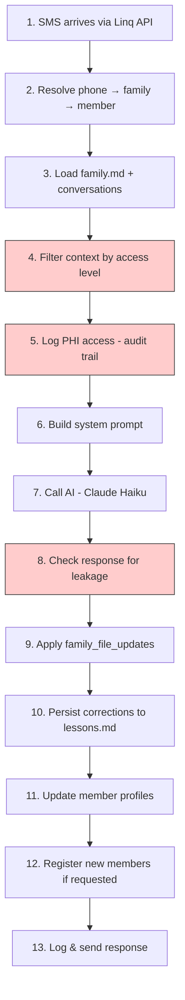
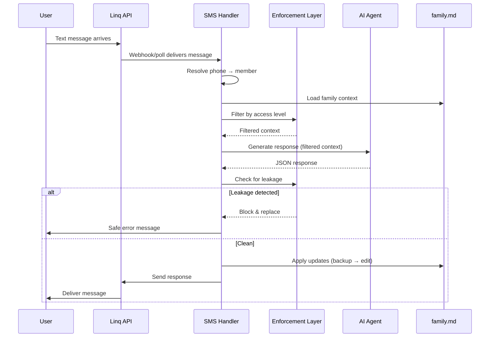

## The complete message pipeline

Every message that comes into CareSupport flows through a 13-step pipeline that ensures safety, context-awareness, and proper state management.



<Info>
  **Source:** This pipeline is implemented in `runtime/scripts/sms_handler.py` - lines 914-1228
</Info>

---

## Step-by-step breakdown

<Steps>
  <Step title="Message arrives via Linq API">
    SMS, iMessage, or RCS messages arrive through the Linq Partner API V3. The system supports both webhook push (real-time) and polling (15-second intervals).
    
    **Handlers:**
    - `webhook_receiver.py` - Push notifications (preferred)
    - `poll_inbound.py` - Cron-based polling (fallback)
    - `linq_gateway.py` - Send/receive API client
  </Step>

  <Step title="Resolve phone → family → member → role">
    The phone number is matched against all family routing tables to identify:
    - Which family this person belongs to
    - Their role (coordinator, caregiver, family member)
    - Their access level (full, limited, schedule-only)
    - Their relationship to the care recipient
    
    **Code reference:** `sms_handler.py:122-168` (resolve_phone, resolve_chat_id)
    
    If the phone number is unknown, the message is rejected and logged to the PHI audit trail.
  </Step>

  <Step title="Load family context">
    The system loads three sources of context:
    
    **Family files:**
    - `family.md` - Core care context (schedules, team, status)
    - `schedule.md` - Detailed schedule if split out
    - `medications.md` - Medication list if split out
    
    **Conversation history:**
    - Last 50 messages with this phone number
    - Monthly log files in `conversations/{phone}/`
    
    **Member profile:**
    - Personal context from `members/{name}.md`
    - Communication preferences
    - Care responsibilities
    
    **Code reference:** `sms_handler.py:185-231`
  </Step>

  <Step title="Filter context by access level (ENFORCEMENT)">
    **This is mechanical safety, not prompt-level.**
    
    Before the AI sees anything, the enforcement layer filters the family.md content based on the member's access level:
    
    | Access Level | Can See |
    |--------------|--------|
    | **full** | Everything (coordinators only) |
    | **limited** | Care recipient info, schedules, team contacts, medications |
    | **schedule** | Schedules and basic contact info only |
    
    Sections like `## Medical History`, `## Sensitive Notes`, and `## Crisis Protocol` are stripped before the AI processes them.
    
    **Code reference:** `enforcement/role_filter.py` - filter_family_context()
    
    <Warning>
      The AI never sees data above the member's access level. This is enforced in code, not through prompting.
    </Warning>
  </Step>

  <Step title="Log PHI access (ENFORCEMENT)">
    Every time someone accesses family context, it's logged with:
    - Timestamp
    - Family ID
    - Accessor phone & role
    - Access level
    - Which sections were loaded
    - The trigger message (what prompted the access)
    
    This creates a HIPAA-compliant audit trail for all PHI access.
    
    **Code reference:** `enforcement/phi_audit.py` - PHIAuditLogger
  </Step>

  <Step title="Build system prompt">
    The AI's context is assembled from multiple sources:
    
    **Identity & behavior:**
    - `SOUL.md` - Agent identity, voice, and constraints
    - `agent_root.md` - Routing logic for loading protocols
    - `capabilities.md` - Explicit CAN/CANNOT list
    
    **Domain knowledge:**
    - `skills/*.md` - Conversation patterns (social, onboarding, scheduling)
    - `protocols/*.md` - 16 care protocols loaded on demand
    
    **Learning system:**
    - `lessons.md` (global) - Corrections from all conversations
    - `families/{id}/lessons.md` (family-specific) - Local corrections
    
    **Current context:**
    - Filtered family.md (scoped to member's access)
    - Recent conversation history
    - Member profile
    - Current date/time
    
    **Code reference:** `sms_handler.py:289-397` (build_system_context)
  </Step>

  <Step title="Call AI agent (Claude Haiku via OpenRouter)">
    The message is sent to Claude Haiku with a structured JSON schema response format:
    
    ```json
    {
      "sms_response": "The text message to send back",
      "internal_notes": "Agent's reasoning (not shown to user)",
      "needs_outreach": [
        {"phone": "+1234567890", "name": "Solan", "message": "..."}
      ],
      "family_file_updates": [
        {"section": "Schedule", "operation": "append", "content": "...", "old_content": ""}
      ],
      "self_corrections": ["[behavioral] lesson learned"],
      "member_updates": [...],
      "routing_updates": [...]
    }
    ```
    
    **Fallback chain:** Haiku → Gemini Flash → GPT-4o-mini (if primary fails)
    
    **Timeout:** 45 seconds per attempt, 3 retries
    
    **Code reference:** `sms_handler.py:487-535` (generate_response)
  </Step>

  <Step title="Check response for leakage (ENFORCEMENT)">
    Before sending anything back, the enforcement layer scans the response for information the member shouldn't see:
    
    - Medical diagnoses
    - Sensitive family dynamics
    - Financial information
    - Crisis protocol details
    
    If leakage is detected, **the response is blocked** and replaced with:
    
    > "I'm sorry, I can't share that information with your access level. Please contact the care coordinator if you need more details."
    
    The blocked response is logged to the PHI audit trail.
    
    **Code reference:** `enforcement/role_filter.py` - check_outbound_message()
    
    <Warning>
      This is post-check mechanical filtering. If the AI tries to leak information, the enforcement layer stops it.
    </Warning>
  </Step>

  <Step title="Apply family_file_updates (PERSISTENCE)">
    The agent can request updates to the family file using surgical edits:
    
    **Operations:**
    - `append` - Add to the end of a section
    - `prepend` - Add to the beginning of a section
    - `replace` - Find and replace specific content
    
    **Safety measures:**
    - Backup created before every edit
    - Only existing sections can be modified
    - Find-and-replace requires exact match
    - High-risk updates (medications, member changes) require approval
    
    **Approval workflow:**
    If an update is classified as "needs approval" (like changing medication dosage), it's queued and coordinators are texted a YES/NO confirmation request.
    
    **Code reference:** `enforcement/family_editor.py` - apply_updates()
    
    <Note>
      Files are **edited**, never overwritten. This prevents data loss from concurrent updates or AI hallucination.
    </Note>
  </Step>

  <Step title="Persist corrections to lessons.md">
    When someone corrects the agent ("that's wrong" / "don't do that again" / "remember this"), the correction is immediately written to the family's `lessons.md` file.
    
    **Categories:**
    - `[behavioral]` - How to reason/respond
    - `[factual]` - Care facts about this family
    - `[operational]` - System behavior patterns
    
    **Max 30 entries per family** (oldest auto-pruned)
    
    These lessons are loaded into every future conversation with that family.
    
    **Code reference:** `sms_handler.py:664-684` (_persist_lessons)
  </Step>

  <Step title="Update member profiles">
    The agent can update member profile files with:
    - Communication preferences
    - Availability changes
    - Personal context ("prefers calls after 6pm")
    - Interaction history
    
    **Code reference:** `sms_handler.py:686-713` (_persist_member_updates)
  </Step>

  <Step title="Register new members (if requested)">
    When a coordinator says "add [name] at [phone]", the agent can:
    
    1. Add them to `routing.json`
    2. Create their member profile in `members/{name}.md`
    3. Assign role and access level
    
    **Only coordinators (full access) can trigger this.**
    
    **Code reference:** `sms_handler.py:716-812` (_persist_routing_updates)
  </Step>

  <Step title="Log and send response">
    The final response is:
    1. Logged to conversation history (`conversations/{phone}/`)
    2. Logged to family timeline (`families/{id}/timeline/`)
    3. Logged to PHI audit trail
    4. Sent back via Linq API
    
    If the agent requested outreach ("I'll message Solan"), those messages are queued and sent shortly after.
  </Step>
</Steps>

---

## Message flow diagram



---

## Key design decisions

<AccordionGroup>
  <Accordion title="Why files instead of a database?">
    **Human-readable state:** Anyone can open `family.md` and understand the current care situation. No SQL queries needed.
    
    **Version control:** Every change can be tracked with git. "What did the schedule look like last Tuesday?" is a `git log` away.
    
    **No vendor lock-in:** Your care data is markdown files. You can move them anywhere.
    
    **Atomic edits:** The surgical edit model (find-and-replace) prevents race conditions better than traditional DB updates.
  </Accordion>

  <Accordion title="Why mechanical safety instead of prompt engineering?">
    **Prompts are unreliable:** An adversarial user can jailbreak prompt-level constraints. Code-level enforcement cannot be bypassed.
    
    **Audit requirements:** HIPAA compliance requires mechanical controls, not "we told the AI not to share PHI."
    
    **Clear boundaries:** The AI never sees restricted data. It can't leak what it doesn't have access to.
  </Accordion>

  <Accordion title="Why surgical edits instead of file rewrites?">
    **Prevents data loss:** If the AI hallucinates or misunderstands, find-and-replace fails cleanly. Rewriting the whole file would destroy real data.
    
    **Concurrent safety:** Two messages arriving simultaneously can't corrupt the file. Each edit is atomic.
    
    **Traceable changes:** Backups before every edit. You can always undo.
  </Accordion>

  <Accordion title="Why 16 care protocols?">
    The agent loads domain knowledge on demand based on message intent:
    - "Can someone take auntie to her appointment?" → appointment-coordination protocol
    - "She missed her morning meds" → medication-management protocol
    - "Liban is unavailable this weekend" → caregiver-handoff protocol
    
    This keeps the context window manageable while giving the agent expert knowledge when it matters.
  </Accordion>
</AccordionGroup>

---

## What's next?

<CardGroup cols={2}>
  <Card title="Architecture Deep Dive" icon="sitemap" href="/architecture">
    System domains, state management, and dependency rules
  </Card>
  <Card title="Security & Enforcement" icon="shield" href="/security">
    How PHI protection and audit logging work
  </Card>
  <Card title="Care Protocols" icon="book-medical" href="/protocols">
    The 16 domain protocols the agent uses
  </Card>
  <Card title="API Reference" icon="code" href="/api/sms-handler">
    Integrate the SMS handler into your systems
  </Card>
</CardGroup>
