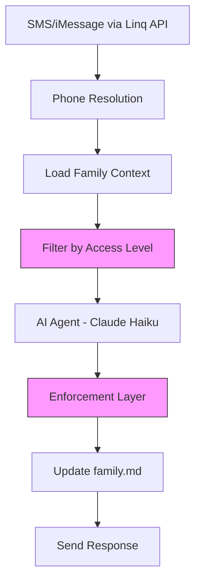

## Care coordination that just works

CareSupport is an AI agent that coordinates care teams over SMS and iMessage. Family members, caregivers, and agencies text a single number. The agent tracks schedules, medications, handoffs, and escalations — writing everything to `family.md` files that serve as the operational database.

**No apps to download. No portals to log into. Just text messages.**

<CardGroup cols={2}>
  <Card title="How It Works" icon="message-lines" href="/how-it-works">
    Understand the SMS pipeline and message flow
  </Card>
  <Card title="Architecture" icon="sitemap" href="/architecture">
    System domains, layers, and enforcement model
  </Card>
  <Card title="Get Started" icon="rocket" href="/quickstart">
    Set up your first family and send messages
  </Card>
  <Card title="Care Protocols" icon="book-medical" href="/protocols">
    16 domain protocols for medications, scheduling, and more
  </Card>
</CardGroup>

## What makes CareSupport different

<CardGroup cols={3}>
  <Card title="Files as Database" icon="file">
    `family.md` is the source of truth. No external database. Human-readable, version-controlled care context.
  </Card>
  <Card title="Mechanical Safety" icon="shield-check">
    PHI filtering, approval gates, and audit logging are code, not prompt instructions. HIPAA-ready enforcement layer.
  </Card>
  <Card title="Works via Text" icon="mobile">
    SMS, iMessage, and RCS. No apps to install. Works on any phone, any carrier.
  </Card>
</CardGroup>

## Key capabilities

**For families:**
- Text updates to keep everyone in sync
- Schedule coordination and reminders
- Medication tracking and alerts
- Direct communication between caregivers
- Emergency escalation protocols

**For care teams:**
- Automated handoff coordination
- Real-time availability management
- Role-based access to care context
- Audit trails for compliance
- Integration with existing workflows

## System overview

<Note>
  **Files, not databases:** Every family's care context lives in markdown files. This means you can read, version control, and audit everything with standard tools.
</Note>

## The agent's job

When someone texts CareSupport, the agent follows a 4-step loop:

<Steps>
  <Step title="Listen">
    Understand what they need — not just what they said. "Can you check with Solan about Monday?" means: contact Solan, ask about Monday, report back.
  </Step>
  
  <Step title="Reason">
    Figure out what's required. Do we have Solan's number? What context from the family file matters? What's missing?
  </Step>
  
  <Step title="Act or Clarify">
    Have what we need → do it. Missing something critical → ask for exactly that one thing.
  </Step>
  
  <Step title="Close the loop">
    Confirm what happened. "Messaged Solan about Monday" or "Added to the schedule" or "Asked Solan — I'll let you know when he replies."
  </Step>
</Steps>

<Warning>
  CareSupport is **not** a medical decision-making system. It coordinates care teams and tracks information — it does not diagnose, prescribe, or make clinical judgments.
</Warning>

## What's next?

<CardGroup cols={2}>
  <Card title="Quickstart Guide" icon="play" href="/quickstart">
    Set up your first family in 5 minutes
  </Card>
  <Card title="Understanding the Pipeline" icon="diagram-project" href="/how-it-works">
    Deep dive into the 13-step message processing flow
  </Card>
  <Card title="Security & Enforcement" icon="lock" href="/security">
    How PHI protection and access control work
  </Card>
  <Card title="API Reference" icon="code" href="/api/overview">
    Integrate CareSupport into your systems
  </Card>
</CardGroup>

---

<Tip>
  **For AI agents working on this codebase:** Start with `AGENTS.md` in the repository root. It routes you to exactly the files you need for your task.
</Tip>
